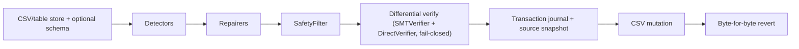
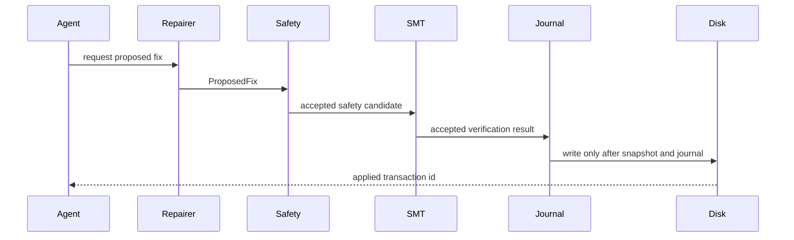
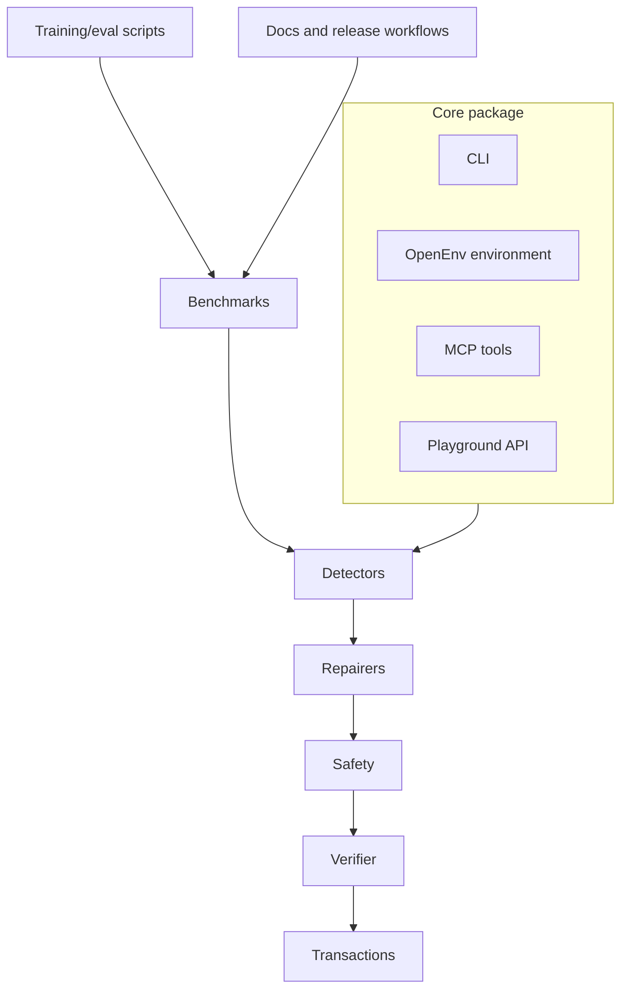

# DataForge Architecture

Last updated: 2026-05-20.

DataForge is the official release name for the DataForge codebase: a local,
auditable data-quality repair system. The core package is
kept separate from playground, training, and model-demo surfaces so the CLI can
remain installable without web or model dependencies.

The purpose, philosophy, first principles, honesty doctrine, vision, and mission
this architecture serves are stated canonically in [PRODUCT.md](PRODUCT.md). This
document describes *how* the system upholds that constitution; PRODUCT.md is the
authority on *why*.

## Runtime Layers

- **CLI and terminal UI**: Typer commands in `dataforge/cli/` with Rich output.
  Public commands are `profile`, `repair`, `revert`, `audit`, `bench`, `watch`,
  and `release`.
- **Schema inference**: `dataforge.schema_inference` emits reviewable
  `SchemaInferenceResult` artifacts for profile and benchmark use. Inferred
  constraints must be written as `constraint_review_v1` artifacts and marked
  accepted before repair or verifier use. Pending and rejected candidates never
  affect repair behavior.
- **Detectors**: pandas-based scanners organized as an additive ensemble. Tier 0
  (`type_mismatch`, `decimal_shift`, `fd_violation`) are the established,
  high-precision detectors that own their cells. Tier 1 (`missing_value`,
  `format_violation`, `categorical_normalization`, `outlier`, `duplicate_row`)
  are strictly additive - they only claim cells no tier-0 detector flagged, so a
  new detector can never regress the proven floor. `run_all_detectors` returns
  one issue per cell, ranked by (tier, severity, confidence, registration order).
  Detectors emit typed issues and never mutate data.
- **Detection vs correction**: detection (flagging an error) and correction
  (producing the exact value) are tracked separately. A class can be
  well-detected yet not auto-correctable when no correct value is derivable; such
  classes are detection-only and surfaced for review rather than guessed.
- **Calibration**: `dataforge.calibration` maps a proposal's confidence to an
  auto-apply/review decision via thresholds fit to a target precision, so breadth
  never lowers auto-apply precision below the bar. `dataforge.calibration_map`
  adds a post-hoc, monotone probability map (isotonic via pool-adjacent-violators,
  or Platt) fit per issue type on a calibration split, so a reported confidence
  reads as an honest probability (measured ECE 0.8533 -> 0.0 on real corrector
  samples). Because it is monotone it fixes calibration without changing the
  conformal-certifiable ranking. `dataforge.conformal` certifies each class's
  auto-apply threshold distribution-free and a Population Stability Index monitor
  downgrades auto-apply to review under drift; the calibrated score, the drift
  guard, and the certified threshold are combined in the engine's auto-apply gate.
- **Repairers**: deterministic proposal generators for shipped detector
  families. Optional LLM fallback remains explicit and is not part of the
  default write path.
- **LLM corrector** (opt-in, `allow_llm`): a grounded, contract-bound repairer
  (`repairers/llm_corrector.py`) for correction-bottleneck classes with no
  derivable value (missing-value fills, normalization, typos). Each sampled
  value must satisfy a `CorrectionContract` (detector finding + inferred
  type/domain/regex/FD, `repairers/contract.py`) and the same inferred-constraint
  guard the verifier enforces (`verifier/inferred.py`), so it can only propose
  values the verifier would accept. Confidence is a self-consistency agreement
  fraction. It is registered only when `allow_llm` is set (as a fallback behind
  the deterministic missing_value repairer, and as the correction path for
  format/categorical/outlier); with `allow_llm` off the registry and the write
  path are byte-identical. Corrector output is propose-not-apply: it surfaces as
  `suggested_fixes` and auto-applies only under a confirmed LLM write plus a
  calibrated per-class threshold (`calibration.py`).
- **Provable-only auto-apply**: every accepted fix is classified `proven`
  (deterministic OR verified against an authoritative schema) or
  `plausibility_only` (an LLM value with no authoritative schema, vetted only by
  the advisory inferred guard). Only proven fixes auto-apply; a plausibility-only
  fix is held (`review_reason="floor_cannot_verify"`) unless the explicit
  `allow_unproven_autoapply` opt-in is set, in which case the receipt records it
  truthfully as `plausibility_only`. This keeps the known inferred-guard gaps
  latent by construction, under any policy.
- **Trust certificate**: the receipt is a self-contained record (source/post
  hashes, `applied_fixes` with `verification_strength`, proof obligations, revert
  command). `certificate.verify_certificate` re-checks hashes and structural trust
  invariants; `certificate.reverify_certificate` re-derives ACCEPT per applied
  cell against the certified data and confirms the recorded strength labels are
  truthful. On the authoritative-schema path this re-derivation is run through the
  differential pair (SMT + Direct, fail-closed), so it is independent in data,
  execution, AND implementation (`reverify_independent_agreement`).
- **Safety**: constitution-backed policy checks that deny unsafe edits,
  row deletion, conflicting batch writes, and unconfirmed sensitive changes.
  Unconfirmed-LLM-write escalation covers both live and cached LLM provenance.
- **Verification (N-version)**: two independently-written constraint checkers
  enforce the authoritative-schema specification. The primary `SMTVerifier`
  (`verifier/smt.py`) compiles constraints into a z3 SMT problem; the diverse
  `DirectVerifier` (`verifier/direct.py`) evaluates the same spec by direct Python
  table inspection and imports no z3 (the shared result contract lives in the
  dependency-free `verifier/result.py`). `verifier/differential.py` runs both and
  combines them FAIL-CLOSED -- a fix auto-applies only when both accept, so a bug
  in either checker can only withhold a fix, never wave through a corrupting one.
  Default-on for the authoritative path via
  `RepairPipelineRequest.require_independent_agreement`; the schema-less advisory
  inferred guard remains single-implementation by design (it only gates
  non-auto-applying plausibility fixes). Equivalence is pinned by a Hypothesis
  suite that asserts the two agree over random schemas/tables/fixes.
- **Patch planning**: `PatchPlan` is the backend-neutral write contract for
  table stores. It records row identity, expected old values, forward SQL,
  rollback SQL, preflight probes, verifier obligations, safety verdicts, and
  audit metadata before any warehouse mutation.
- **Transactions**: append-only hash-chained JSONL journals, immutable source
  snapshots, post-state hash guards, local audit verification, and
  byte-for-byte CSV revert or backend rollback for proven table stores.
- **Benchmarks**: Hospital, Flights, and Beers loaders, method runners, quota
  accounting, and generated markdown reports.
- **OpenEnv environment**: HTTP and in-process environment with typed actions:
  `INSPECT_ROWS`, `SQL_QUERY`, `STAT_TEST`, `PATTERN_MATCH`, `HYPOTHESIS`,
  `DIAGNOSE`, `FIX`, and `ROOT_CAUSE`.
- **Verified agent**: an opt-in autonomous repair controller
  (`dataforge/agent/`) exposed as `dataforge repair --agent` and the MCP tool
  `dataforge_agent_repair`. It seeds with the deterministic floor, runs an
  autonomous policy over the residual issues, and routes every proposed `FIX`
  through the same safety constitution and SMT verifier before committing
  through the shared reversible transaction path. The policy backend is
  user-selectable: `hosted` (provider client, default; `--provider groq|gemini`;
  fails fast without an API key), `local` (trained model, offline), `deterministic`
  (floor only), or `custom:<name>` (registered via `register_policy`). Agent
  fixes are strictly additive on top of the verified floor, so the agent can
  never ship below the deterministic baseline. An agent value is LLM-derived, so it
  auto-applies only when *proven* (verified against an authoritative schema); otherwise
  it is held in `held_fixes` unless `--allow-unproven-autoapply` is set, and then it is
  recorded truthfully as not-proven. That gate is enforced inside `apply_transaction`
  itself, so it holds for any policy rather than depending on the controller invoking it
  — see `docs/trust/write-surface-uniformity.md` for why that distinction is load-bearing.
  A benchmark gate (`dataforge.bench.agent_promotion_verdict`,
  `dataforge.release.agent_gate`) blocks promotion to the default path until the
  agent beats baseline F1 with zero safety regressions.
- **Causal analyzer**: column-level DAG utilities, functional-dependency priors,
  PC discovery fallback, and minimal root-set analysis.
- **Playground**: FastAPI backend staged into a Hugging Face Docker Space and a
  static frontend deployed through Cloudflare Workers Static Assets.
- **Training and model demos**: SFT trajectory builders, GRPO reward/config
  hooks, readiness and release verifiers, Kaggle notebooks, Hub metadata, and a
  separate Gradio model-demo Space.
- **MCP integration**: nested standalone `dataforge-mcp/` source directory
  building the `dataforge_07_mcp` distribution and exposing structured DataForge
  tools over stdio by default.

## Safety Invariant

Every applied repair must follow this order:

Dry-run paths may stop before mutation, but they should exercise the same
proposal, safety, and verification logic where feasible. The CLI, MCP server,
playground API, verified agent, and OpenEnv environment must preserve this
invariant.

## Data And Control Flow

The core pipeline owns repair behavior. Surrounding surfaces can expose or test
the pipeline, but they should not create parallel write semantics.

## Table Stores

`dataforge.stores` contains the v1 table-store boundary:

- `CSVStore` wraps the existing release-gated CSV transaction engine.
- `DuckDBStore` is the local warehouse conformance adapter and supports
  patch-plan dry-run, apply, audit, and rollback when stable row identity
  columns are configured.
- Snowflake, BigQuery, and Databricks adapters emit non-mutating patch plans and
  refuse apply until credentialed conformance tests prove reversible semantics.

Warehouse apply is denied unless the patch plan has stable row identity,
preflight probes, rollback SQL, and deterministic verification evidence.

## Dependency Guidance

Core runtime dependencies in `pyproject.toml`:

- `pandas` and `pyarrow` for tabular data handling.
- `pydantic` for typed issues, fixes, schemas, environment observations, and
  release evidence.
- `typer` and `rich` for CLI UX.
- `pyyaml` for schema and constitution loading.
- `z3-solver` for SMT verification.
- `networkx`, `causal-learn`, `hyppo`, and `scipy` for causal discovery and
  statistical tests.
- `httpx`, `tenacity`, and `python-dotenv` for optional provider clients.
- `sqlglot` and `duckdb` for read-only SQL parsing and execution.

Optional extras and scoped dependencies:

- `dev`: pytest, ruff, mypy, Hypothesis, benchmark, and Hub tooling.
- `train`: pinned Kaggle SFT/GRPO stack.
- `eval`: plotting libraries for evaluation summaries.
- `playground`: FastAPI, Uvicorn, multipart upload, and rate limiting.
- `openenv`: OpenEnv protocol dependency.
- `dataforge-mcp/`: source directory for the separate planned
  `dataforge_07_mcp` PyPI distribution with MCP dependencies.
- `playground-model/`: Gradio and model-demo dependencies only.

## Release Boundaries

- `dataforge_07` is the final PyPI/TestPyPI core CLI/library distribution. It is
  not published yet; release tags should be created only after local gates and
  PyPI trusted-publisher configuration are verified. It intentionally keeps the
  `dataforge` Python import namespace and CLI for the 0.1 line. The legacy
  `data_quality_env` namespace is source-tree compatibility/regression material
  and is excluded from the core wheel and source distribution. Release gates
  verify that clean installs cannot import `data_quality_env` or leak from the
  source checkout.
- `dataforge_07_mcp` is the planned nested standalone distribution for
  `dataforge-mcp-v*` release tags after PyPI publication evidence is verified.
- `https://dataforge.praneshrajan15.workers.dev/playground` is the production
  playground route for the full original vision. This is the release URL.
- SFT datasets and checkpoints are Hugging Face artifacts verified by
  `scripts/model/verify_sft_release.py`.
- GRPO checkpoints are Hugging Face artifacts verified by
  `scripts/model/verify_grpo_release.py` before they can be cited as quality
  improvements.
- Generated Hugging Face staging directories are deployment artifacts, not
  canonical documentation sources.
