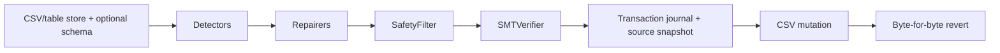
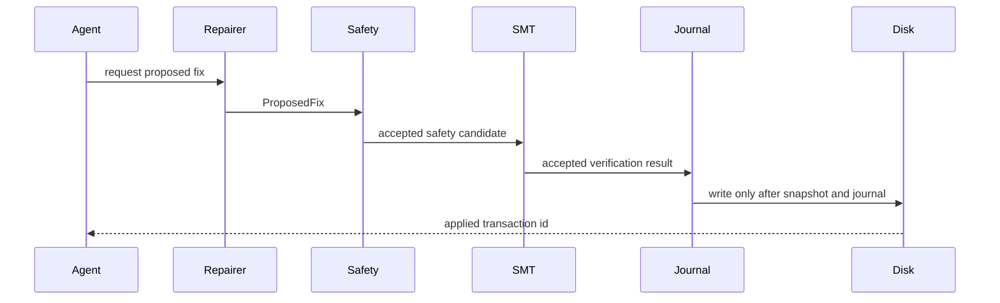
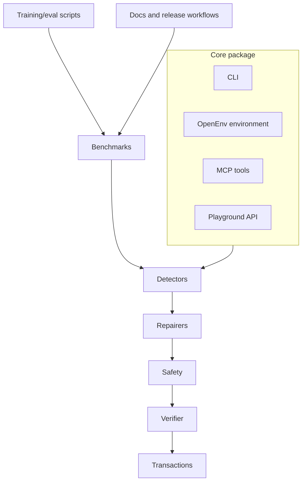

# DataForge Architecture

Last updated: 2026-05-20.

DataForge is the official release name for the DataForge codebase: a local,
auditable data-quality repair system. The core package is
kept separate from playground, training, and model-demo surfaces so the CLI can
remain installable without web or model dependencies.

## Runtime Layers

- **CLI and terminal UI**: Typer commands in `dataforge/cli/` with Rich output.
  Public commands are `profile`, `repair`, `revert`, `audit`, `bench`, `watch`,
  and `release`.
- **Schema inference**: `dataforge.schema_inference` emits reviewable
  `SchemaInferenceResult` artifacts for profile and benchmark use. Inferred
  constraints must be written as `constraint_review_v1` artifacts and marked
  accepted before repair or verifier use. Pending and rejected candidates never
  affect repair behavior.
- **Detectors**: pandas-based scanners for `type_mismatch`, `decimal_shift`,
  and `fd_violation`. Detectors emit typed issues and never mutate data.
- **Repairers**: deterministic proposal generators for shipped detector
  families. Optional LLM fallback remains explicit and is not part of the
  default write path.
- **Safety**: constitution-backed policy checks that deny unsafe edits,
  row deletion, conflicting batch writes, and unconfirmed sensitive changes.
- **Verification**: Z3-backed SMT checks that reject fixes which violate schema
  constraints or cannot be proven safe.
- **Patch planning**: `PatchPlan` is the backend-neutral write contract for
  table stores. It records row identity, expected old values, forward SQL,
  rollback SQL, preflight probes, verifier obligations, safety verdicts, and
  audit metadata before any warehouse mutation.
- **Transactions**: append-only hash-chained JSONL journals, immutable source
  snapshots, post-state hash guards, local audit verification, and
  byte-for-byte CSV revert or backend rollback for proven table stores.
- **Benchmarks**: Hospital, Flights, and Beers loaders, method runners, quota
  accounting, and generated markdown reports.
- **OpenEnv environment**: HTTP and in-process environment with typed actions:
  `INSPECT_ROWS`, `SQL_QUERY`, `STAT_TEST`, `PATTERN_MATCH`, `HYPOTHESIS`,
  `DIAGNOSE`, `FIX`, and `ROOT_CAUSE`.
- **Causal analyzer**: column-level DAG utilities, functional-dependency priors,
  PC discovery fallback, and minimal root-set analysis.
- **Playground**: FastAPI backend staged into a Hugging Face Docker Space and a
  static frontend deployed through Cloudflare Workers Static Assets.
- **Training and model demos**: SFT trajectory builders, GRPO reward/config
  hooks, readiness and release verifiers, Kaggle notebooks, Hub metadata, and a
  separate Gradio model-demo Space.
- **MCP integration**: nested standalone `dataforge-mcp/` source directory
  building the `dataforge_07_mcp` distribution and exposing structured DataForge
  tools over stdio by default.

## Safety Invariant

Every applied repair must follow this order:

Dry-run paths may stop before mutation, but they should exercise the same
proposal, safety, and verification logic where feasible. The CLI, MCP server,
playground API, and OpenEnv environment must preserve this invariant.

## Data And Control Flow

The core pipeline owns repair behavior. Surrounding surfaces can expose or test
the pipeline, but they should not create parallel write semantics.

## Table Stores

`dataforge.stores` contains the v1 table-store boundary:

- `CSVStore` wraps the existing release-gated CSV transaction engine.
- `DuckDBStore` is the local warehouse conformance adapter and supports
  patch-plan dry-run, apply, audit, and rollback when stable row identity
  columns are configured.
- Snowflake, BigQuery, and Databricks adapters emit non-mutating patch plans and
  refuse apply until credentialed conformance tests prove reversible semantics.

Warehouse apply is denied unless the patch plan has stable row identity,
preflight probes, rollback SQL, and deterministic verification evidence.

## Dependency Guidance

Core runtime dependencies in `pyproject.toml`:

- `pandas` and `pyarrow` for tabular data handling.
- `pydantic` for typed issues, fixes, schemas, environment observations, and
  release evidence.
- `typer` and `rich` for CLI UX.
- `pyyaml` for schema and constitution loading.
- `z3-solver` for SMT verification.
- `networkx`, `causal-learn`, `hyppo`, and `scipy` for causal discovery and
  statistical tests.
- `httpx`, `tenacity`, and `python-dotenv` for optional provider clients.
- `sqlglot` and `duckdb` for read-only SQL parsing and execution.

Optional extras and scoped dependencies:

- `dev`: pytest, ruff, mypy, Hypothesis, benchmark, and Hub tooling.
- `train`: pinned Kaggle SFT/GRPO stack.
- `eval`: plotting libraries for evaluation summaries.
- `playground`: FastAPI, Uvicorn, multipart upload, and rate limiting.
- `openenv`: OpenEnv protocol dependency.
- `dataforge-mcp/`: source directory for the separate planned
  `dataforge_07_mcp` PyPI distribution with MCP dependencies.
- `playground-model/`: Gradio and model-demo dependencies only.

## Release Boundaries

- `dataforge` is the final core CLI/library distribution. It is not published
  by this project yet because the PyPI/TestPyPI name is an external ownership
  gate; release tags should be created only after local gates and PyPI
  trusted-publisher ownership are verified. The legacy
  `data_quality_env` namespace is source-tree compatibility/regression material
  and is excluded from the core wheel and source distribution. Release gates
  verify that clean installs cannot import `data_quality_env` or leak from the
  source checkout.
- `dataforge_07_mcp` is the planned nested standalone distribution for
  `dataforge-mcp-v*` release tags after PyPI publication evidence is verified.
- `https://dataforge.praneshrajan15.workers.dev/playground` is the production
  playground route for the full original vision. This is the release URL.
- SFT datasets and checkpoints are Hugging Face artifacts verified by
  `scripts/model/verify_sft_release.py`.
- GRPO checkpoints are Hugging Face artifacts verified by
  `scripts/model/verify_grpo_release.py` before they can be cited as quality
  improvements.
- Generated Hugging Face staging directories are deployment artifacts, not
  canonical documentation sources.
