# Data Quality Validation & Cleaning Pipeline

An RL environment for training agents to **detect, classify, and fix** data quality
issues in tabular datasets — format errors, duplicates, missing values, referential
integrity violations, outliers, and business rule breaches.

Built on [OpenEnv](https://github.com/meta-pytorch/openenv-core) for standardized
agent–environment interaction via WebSocket/HTTP.

## Architecture

```mermaid
sequenceDiagram
    participant Agent
    participant Client as DataQualityEnv<br/>(client.py)
    participant Server as FastAPI + WebSocket<br/>(server/app.py)
    participant Env as DataQualityEnvironment<br/>(server/data_quality_environment.py)
    participant GT as Ground Truth<br/>(datasets/*.json)

    Agent->>Client: reset(task_id)
    Client->>Server: WS {"type": "reset", "task_id": "..."}
    Server->>Env: env.reset(task_id)
    Env->>GT: Load dataset + ground truth
    Env-->>Server: DataQualityObservation (schema, sample rows)
    Server-->>Client: WS {"observation": {...}}
    Client-->>Agent: obs (visible_rows, schema_info, ...)

    loop Episode Steps
        Agent->>Client: step(DataQualityAction)
        Client->>Server: WS {"type": "step", "payload": {...}}
        Server->>Env: env.step(action)
        Env->>GT: Score against ground truth
        Env-->>Server: DataQualityObservation (result, reward)
        Server-->>Client: WS {"observation": {...}}
        Client-->>Agent: obs (action_result, reward_delta, ...)
    end

    Agent->>Client: step(finalize)
    Client-->>Agent: obs (done=True, final score)
```



## Quick Start

### 1. Server

```bash
# Option A: Docker (recommended for deployment)
docker build -t data_quality_env -f server/Dockerfile .
docker run -p 7860:7860 data_quality_env

# Option B: Local development
pip install -e ".[server]"
uvicorn server.app:app --host 0.0.0.0 --port 7860 --reload
```

### 2. Agent Interaction

```python
from data_quality_env import (
    DataQualityAction, DataQualityEnv,
    IssueType, FixType,
)

with DataQualityEnv(base_url="http://localhost:7860") as env:
    # Reset — get initial observation with schema and sample rows
    obs = env.reset(task_id="task_1_format_fixer")
    print(f"Dataset: {obs.total_rows} rows × {obs.total_columns} columns")

    # Inspect more rows
    obs = env.step(DataQualityAction.inspect(row_indices=[0, 1, 2, 3, 4]))
    for row in obs.visible_rows:
        print(row)

    # Diagnose an issue
    obs = env.step(DataQualityAction.diagnose(
        row_index=3, column_name="email",
        issue_type=IssueType.FORMAT_ERROR,
    ))
    print(f"Result: {obs.action_result}, Reward: {obs.reward_delta:+.2f}")

    # Fix it
    obs = env.step(DataQualityAction.fix(
        row_index=3, column_name="email",
        fix_type=FixType.CORRECT_VALUE,
        new_value="john.doe@example.com",
        justification="Missing @ between 'doe' and 'example'.",
    ))
    print(f"Result: {obs.action_result}, Reward: {obs.reward_delta:+.2f}")

    # Finalize — receive final score
    obs = env.step(DataQualityAction.finalize())
    print(f"Final score: {obs.cumulative_reward:.4f}")
```

### 3. Baseline Inference

```bash
export OPENAI_API_KEY="your-key"
export ENV_URL="http://localhost:7860"
python inference.py
```

## Action Space

| Action | Required Parameters | Optional | Effect |
|--------|-------------------|----------|--------|
| `inspect` | ≥1 of `row_indices`, `column_names` | `related_table` | View rows, column statistics, or secondary table |
| `diagnose` | `row_index`, `column_name`, `issue_type` | `related_table` | Report a suspected data quality issue |
| `fix` | `row_index`, `column_name`, `fix_type`, `justification` | `new_value` | Apply a correction (see fix_type rules below) |
| `finalize` | *(none)* | | End episode, receive final score |

### Fix Type Rules

| `fix_type` | `new_value` | Semantics |
|------------|-------------|-----------|
| `correct_value` | **Required** | Provide the corrected cell value |
| `delete_row` | **Forbidden** | Remove the entire row (e.g., duplicates) |
| `impute` | Optional | Environment may compute the imputed value |
| `standardize` | Optional | Environment may compute the standardized form |

### Issue Types

`format_error` · `missing_value` · `duplicate` · `near_duplicate` · `type_mismatch` · `outlier` · `referential_integrity` · `cross_field` · `business_rule`

## Observation Space

| Field | Type | Description |
|-------|------|-------------|
| `task_id` | `str` | Active task identifier |
| `schema_info` | `Dict[str, str]` | Column name → data type mapping |
| `total_rows` | `int` | Total rows in dataset |
| `visible_rows` | `List[Dict]` | Rows from last inspect (with `_row_index`) |
| `column_statistics` | `Dict[str, Any]` | Per-column stats from last inspect |
| `secondary_table_rows` | `List[Dict]` | Rows from related table (Task 3) |
| `action_result` | `ActionResult` | `correct` / `incorrect` / `partial` / `already_found` / `error` / `complete` |
| `reward_delta` | `float` | Step reward (positive = correct, negative = penalty) |
| `cumulative_reward` | `float` | Running episode total |
| `issues_found` | `int` | Correctly identified issues so far |
| `issues_remaining_hint` | `RemainingHint` | `none` / `few` / `some` / `many` / `unknown` |
| `steps_taken` | `int` | Steps consumed this episode |
| `max_steps` | `int` | Step budget for this task |
| `done` | `bool` | Whether the episode has ended |
| `message` | `str` | Human-readable feedback |

## Tasks

| Task | ID | Difficulty | Rows | Issues | Fixable | Detection-Only | Max Steps |
|------|----|-----------|------|--------|---------|----------------|-----------|
| Format Fixer | `task_1_format_fixer` | Easy | 50 | 8 | 5 | 3 | 30 |
| Duplicate Detective | `task_2_duplicate_detective` | Medium | 100 | 12 | 6 | 6 | 50 |
| Integrity Auditor | `task_3_integrity_auditor` | Hard | 150+30 | 15 | 12 | 3 | 80 |

**Task 1 — Format Fixer**: Detect and correct formatting errors in a customer database:
malformed emails (missing `@`, double `@@`), invalid calendar dates (Feb 30, Apr 31),
phone number irregularities, and zip code formatting (missing leading zeros, letter contamination).

**Task 2 — Duplicate Detective**: Identify exact duplicate rows (fix with `delete_row`),
detect near-duplicates (name typos, domain typos in emails, unformatted phone numbers),
find missing values and type mismatches across a contacts database.

**Task 3 — Integrity Auditor**: Audit referential integrity across orders and products tables
(`product_id` validation), verify cross-field consistency (`order_total = qty × unit_price × (1 − discount/100)`,
`ship_date ≥ order_date`), detect outliers (extreme quantities, negative prices), and identify
business rule violations (discount > max_discount, future order dates, negative quantities).

## Reward Design

### Step Rewards

| Event | Reward | Notes |
|-------|--------|-------|
| Correct diagnosis | +0.10 | Issue correctly identified at (row, column) |
| + Type bonus | +0.05 | Agent identified the correct `issue_type` |
| Correct fix | +0.15 | Fix value matches ground truth (case-insensitive) |
| + Justification bonus | +0.05 | `justification` field was provided |
| False positive | −0.05 | No issue at the diagnosed location |
| Wrong fix | −0.08 | Fix value does not match expected |
| Detection-only fix attempt | 0.00 | Issue has no deterministic fix (diagnosis is sufficient) |
| Late-step penalty | −0.02/step | Applied after 80% of step budget consumed |
| Invalid/malformed action | −0.01 | Missing required fields, out-of-bounds index, etc. |

### Final Score Formula

```
score = detection_rate × 0.40 + fix_rate × 0.60 − min(0.40, false_positives × 0.05)
```

Where:
- `detection_rate` = correctly diagnosed / total ground-truth issues
- `fix_rate` = correctly fixed / total fixable issues (issues with an `expected` value)
- False positive penalty capped at 0.40 to prevent runaway negative scores
- Result clamped to [0.0, 1.0]

### Detection-Only Issues

Some issues (e.g., phone numbers with unknown digits, non-existent product references)
cannot be fixed deterministically from available data. These are **detection-only** —
diagnosing them earns the full diagnosis reward, but no fix is expected. Attempting to
fix them returns `action_result="partial"` with zero penalty.

## Environment Variables

| Variable | Default | Description |
|----------|---------|-------------|
| `OPENAI_API_KEY` | *(required)* | API key for LLM inference (also reads `HF_TOKEN`) |
| `ENV_URL` | `http://localhost:7860` | Environment server URL |
| `API_BASE_URL` | `https://api.openai.com/v1` | LLM provider base URL |
| `MODEL_NAME` | `gpt-3.5-turbo` | Chat completion model name |
| `TEMPERATURE` | `0.1` | Sampling temperature for LLM |
| `MAX_TOKENS` | `512` | Max tokens per LLM completion |
| `INFERENCE_RETRIES` | `3` | Max retry attempts on API error |

## Ground Truth Format

```json
{
  "_meta": {
    "generator": "generate_datasets.py",
    "version": "3.0",
    "seed": 42,
    "row_indexing": "0-based",
    "total_issues": 8,
    "fixable_issues": 5,
    "detection_only_issues": 3
  },
  "issues": [
    {
      "row": 3,
      "column": "email",
      "type": "format_error",
      "original": "john.doeexample.com",
      "expected": "john.doe@example.com",
      "description": "Missing @ symbol"
    }
  ]
}
```

- **`row`**: 0-based row index into the dataset
- **`column`**: Column name (or `"_row"` for whole-row issues like duplicates)
- **`type`**: Issue type (matches `IssueType` enum)
- **`expected`** *(optional)*: Expected fix value. Absent = detection-only
- **`description`**: Human-readable explanation

## Project Structure

```
data_quality_env/
├── openenv.yaml                # OpenEnv manifest (port 7860)
├── pyproject.toml              # Project metadata and dependencies
├── README.md                   # This file
├── LICENSE                     # MIT license
├── .gitignore                  # Git exclusions
├── .dockerignore               # Docker build exclusions
├── __init__.py                 # Package exports
├── compat.py                   # openenv-core import resolution layer
├── models.py                   # Pydantic schemas (Action, Observation, State)
├── client.py                   # DataQualityEnv WebSocket client
├── inference.py                # Baseline LLM inference script
├── test_env.py                 # Automated test suite (31 test functions)
├── validate.py                 # Cross-platform pre-submission validation
├── validate.sh                 # CI/Linux pre-submission validation
├── generate_datasets.py        # Deterministic dataset generator
├── datasets/
│   ├── task1_customers.json    # Task 1 dataset (50 rows)
│   ├── task1_ground_truth.json # Task 1 ground truth (8 issues)
│   ├── task2_contacts.json     # Task 2 dataset (100 rows)
│   ├── task2_ground_truth.json # Task 2 ground truth (12 issues)
│   ├── task3_orders.json       # Task 3 primary dataset (150 rows)
│   ├── task3_products.json     # Task 3 secondary dataset (30 rows)
│   └── task3_ground_truth.json # Task 3 ground truth (15 issues)
└── server/
    ├── __init__.py             # Server module exports
    ├── app.py                  # FastAPI + WebSocket server (port 7860)
    ├── data_quality_environment.py  # Core RL environment logic (~1220 lines)
    ├── Dockerfile              # Multi-stage Docker build (port 7860)
    └── requirements.txt        # Server pip dependencies
```

## Development & Testing

```bash
# Run the automated test suite (no Docker/API keys required)
python test_env.py

# Run pre-submission validation (cross-platform)
python validate.py
python validate.py --skip-docker

# Run individual module self-tests
python compat.py              # Verify openenv-core imports
python models.py              # Verify Pydantic schemas
python server/data_quality_environment.py  # Verify environment logic

# Run the environment server locally
uvicorn server.app:app --host 0.0.0.0 --port 7860 --reload

# Or via Docker
docker build -t data_quality_env -f server/Dockerfile .
docker run -p 7860:7860 data_quality_env
curl http://localhost:7860/health
```

## Deploying to Hugging Face Spaces

```bash
# Push to HuggingFace Spaces (requires authentication)
openenv push

# Push to a specific repository as private
openenv push --repo-id my-org/data-quality-env --private
```

The deployed Space provides:
- **Health Check** at `/health` — Container status monitoring
- **WebSocket** at `/ws` — Persistent session endpoint for agent interaction
- **API Documentation** at `/docs` — OpenAPI/Swagger interface (fallback server only)

## Troubleshooting

### Docker build fails
- Verify `.dockerignore` does NOT exclude `datasets/` — the environment loads data at runtime
- Check that `PYTHONPATH=/app/env` is set in Dockerfile
- If package conflicts occur, pin exact versions in `server/requirements.txt`

### `openenv validate` fails
- Run `openenv validate --verbose` for diagnostic details
- Verify `openenv.yaml` has `spec_version: 1`, `name`, `type: environment`, `app`, `port` fields
- If it complains about missing tasks: ensure `openenv.yaml` lists task IDs under `tasks:`

### WebSocket connection refused
- Verify the server is listening on port 7860: `docker logs <container>` or `curl http://localhost:7860/health`
- If using the fallback server, check for import errors in `server/app.py`

### Health check fails
- `curl -v http://localhost:7860/health` — inspect the full response
- If 404: the `/health` endpoint is added explicitly in `app.py` §3 regardless of server tier

### Inference script hangs
- Add `timeout=30` to LLM API calls if not set
- If WebSocket never connects: verify `ENV_URL` uses `http://` (not `ws://`) — the client handles scheme conversion

### HF Space won't deploy
- Check build logs on huggingface.co for error details
- Verify `server/Dockerfile` uses port 7860 in CMD, HEALTHCHECK, and EXPOSE
- Ensure README frontmatter has `sdk: docker` and `app_port: 7860`
- Keep Docker image small: no `numpy`, `pandas`, `pytorch`, or `tensorflow` server-side

### Graders return constant score
- Run `test_score_variance` in `test_env.py` — confirms different behaviors yield different scores
- Verify ground truth has varied issue types and fix values
- Check that `_compute_final_score` uses both detection AND fix ratios

## Invariants

These rules are **never violated** in this codebase:

1. **No hardcoded API keys.** Always use environment variables (`OPENAI_API_KEY`, `HF_TOKEN`).
2. **No localhost in deployed code.** `ENV_URL` is configurable via environment variable.
3. **No runtime dataset generation.** All datasets are static JSON — deterministic and reproducible.
4. **Environment never crashes.** Every code path catches exceptions and returns error observations.
5. **No heavy dependencies server-side.** No `numpy`, `pandas`, `pytorch`, or `tensorflow`.
6. **No redeclared base class fields.** `compat.py` resolves once; `models.py` extends cleanly.
7. **No guessed import paths.** `compat.py` resolves once; all modules use its exports.

## License

MIT — see [LICENSE](LICENSE) for details.
