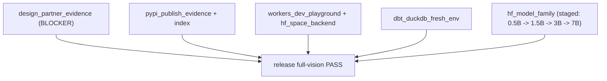

# Full-Vision Roadmap (external-truth gate)

The "full original DataForge vision" is complete only when **external state proves
it** — not when code, tests, and docs say so. That bar is enforced by:

```
dataforge release full-vision --json
```

This roadmap enumerates every gate item, its honest current status, the exact
evidence artifact required, and the external event it is gated on. It follows the
honesty doctrine (see [PRODUCT.md](../PRODUCT.md)): **evidence ships after the
event, never before.** The authoritative live status is always the command above;
this document is the plan, not a substitute for it.

Evidence lives under `docs/evidence/` (or absolute paths on the verifier machine)
and is indexed by `docs/evidence/ledger.json` (validated by
`scripts/evidence/evidence_ledger.py`).

## Gate items

| Gate check | Honest status | Evidence required | Gated on (external event) |
| --- | --- | --- | --- |
| `pypi_publish_evidence` + PyPI/TestPyPI index checks | Evidence committed for the `dataforge_07*` family; live-index verification is what the gate re-checks | Trusted-Publishing attestations, wheel/sdist provenance + SHA-256, fresh-install smoke logs (`docs/evidence/pypi/publish_report.json`, schema `dataforge_pypi_publish_report_v2`) | A real PyPI/TestPyPI publish workflow run under Trusted Publishing |
| `workers_dev_playground` | Playground surface is deployed (Cloudflare Workers) | HTTP 200 from the Workers URL, pointing at the expected HF backend | The Workers deploy staying live and CORS-tied to the release SHA |
| `hf_space_backend` | HF Space backend deployed | Production Space, CORS-compatible with the Workers origin, tied to the release SHA | The Space staying up in production mode |
| `dbt_duckdb_fresh_env` | Adapter proof path exists | Fresh Python 3.12 `dbt-duckdb` end-to-end proof (no skipped test): dry-run/refuse/apply/revert logs + audit artifact | A clean-env dbt run producing the committed artifact |
| `design_partner_evidence` | **NOT MET — the true blocker** (`CONTRIBUTORS.md` carries `Design Partner Gate: NOT MET`) | Sanitized evidence notes for the Marcus/Priya/Shreya/agent-user paths: separate consent records, timings, trust signals, and closed blocking findings under `docs/evidence/` | Real design partners running DataForge and consenting to sanitized write-ups |
| `hf_model_family` | **PARTIAL** — only the 0.5B SFT + 0.5B GRPO rows are verified research evidence (GRPO strict macro F1 0.1393, not deployment-quality); 1.5B/3B/7B rows are roadmap/blocked | Per-row: real public Hub repo, model-card metadata, upstream license, verifier-passed quality evidence, real eval artifacts, satisfied predecessor stage | Completing each gated training stage and publishing its verified artifacts |

## Sequencing (dependency-ordered)



1. **Design-partner evidence** is the highest-leverage blocker and the one that
   cannot be shortcut with engineering. It requires real users. Until the
   `Design Partner Gate: NOT MET` marker is honestly removed (backed by consented,
   sanitized notes), `readme_truth` also forbids any unqualified customer/pilot
   claim in the release docs — by design.
2. **Publication + hosting** (`pypi_publish_evidence`, playground, HF Space) are
   engineering-gated and largely have committed evidence; the gate re-verifies
   them live, so they must stay up and attested.
3. **dbt fresh-env proof** is a reproducible artifact refresh.
4. **Model family** advances only stage-by-stage; each larger size stays "roadmap"
   until its predecessor is a verified public row. The 0.5B rows are research
   evidence, explicitly **not** a production-quality claim, and must never be
   described as deployment-ready.

## Warehouse conformance (adjacent honest boundary)

Not a `full-vision` check, but the same doctrine governs warehouse targets and it
belongs on this roadmap:

- **DuckDB** is the proven local warehouse adapter: patch-plan dry-run, apply,
  audit, and rollback with stable row identity.
- **Snowflake / BigQuery / Databricks** emit non-mutating `patch_plan_v1`
  contracts and **refuse apply** until credentialed conformance suites prove
  reversible transactions. They stay dry-run-only until that evidence exists —
  claiming otherwise would violate the safety invariant.

## The rule

No item on this roadmap may be marked done, and no public claim may be made, until
`dataforge release full-vision --json` (or the relevant conformance suite) passes
on real external state. Missing evidence is the correct state until the external
event actually happens.
