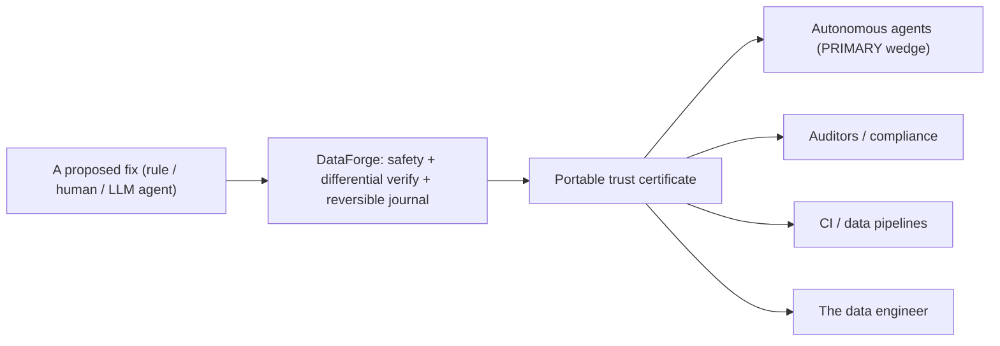

# DataForge Strategy — Center of Gravity (decision)

Status: **decided** with the maintainer (2026-07-19). This is a decision record,
not open-ended strategy prose. It is grounded in measured evidence, and it changes
what DataForge leads with.

## The decision

**DataForge is positioned as a verification / guardrail layer first, with repair
accuracy growing behind it — "both, explicitly staged."** The headline is:
*bring a proposed change from any source — deterministic rule, human, or an
autonomous agent — and DataForge proves it safe, applies it reversibly, and emits
a portable certificate anyone can independently re-verify.* Correction accuracy is
a real but secondary capability that compounds behind that guarantee over time.

## Why (evidence, not vibes)

The measured reality forces this framing. The two halves of the product are not
equally strong:

| Asset | Status | Evidence |
| --- | --- | --- |
| Differential verifier (SMT + Direct, fail-closed) | **Differentiated** | `verifier/differential.py`; N-version equivalence + corruption-oracle property tests |
| Byte-for-byte reversible, hash-chained journal | **Differentiated** | `transactions/`; `test_revert_is_bytes_identical.py`; runtime journaled-revert test |
| Portable, re-verifiable trust certificate | **Differentiated** | `certificate.verify_certificate` / `reverify_certificate`; independent in data, execution, and (schema path) implementation |
| Distribution-free auto-apply gate (conformal + drift) | **Differentiated** | `conformal.py`; enforced by `release/corrector_gate.py` |
| Deterministic correction accuracy | **Weak / narrow, and proposal-stage only** | hospital F1 0.8352 at **proposal stage** (one dataset with injected errors, under our scoring); through the shipped write path a user-declared premise writes **zero** cells and the ground-truth-admitted ceiling is **0.1918**, so there is **no demonstrated end-to-end correction capability** ([declared-premise-capability](trust/declared-premise-capability.md)); flights 0.00 deterministic -> **0.4467 with cross-row entity consensus** (`allow_entity_consensus`); tax sampled 0.00 with 708 false positives |
| LLM corrector accuracy | **Not usable for auto-apply; usable as a proposer when pool-constrained** | free-text ~6-16% precision, ECE ~0.8 (auto-applies nothing, correctly). Constraining it to SELECT from the column's frequent-value pool lifts proposal precision to 0.85 (measured hospital, `--corrector-pool-constrained`); still review-only, never auto-applied |

The moat is the trust machinery; the repairer is, today, commodity and narrow.
A product judged on correction F1 competes on its weakest axis. A product judged
on "nothing incorrect is ever silently written, and you can prove it" competes on
its strongest — and that guarantee is exactly what the emerging market of
autonomous data agents lacks.

The guarantee must hold against untrustworthy *structure*, not only untrustworthy
*fix sources*. DataForge does not blindly trust the constraints it infers about
the data itself: see [trust/constraint-circularity.md](trust/constraint-circularity.md)
for the named risk, the measured evidence, and the standing corruption-oracle proof.

## Who consumes the certificate (all four; staged by leverage)

1. **Autonomous agents (primary wedge, now).** An LLM/agent proposes fixes;
   DataForge is the guardrail that proves+reverses them. This is the timely,
   highest-leverage consumer and it turns the corrector's weak accuracy from a
   liability into a *feature* (the gate correctly refuses ~94% of LLM proposals).
2. **Auditors / compliance.** The certificate is the audit artifact: proof that
   an applied change was verified and is reversible, checkable without trusting or
   re-running DataForge.
3. **CI / data pipelines.** A gate that blocks a merge/deploy unless mutations are
   proven and reversible.
4. **The data engineer.** Interactive local safety net.

## The first validating experiment (concrete, buildable now)

> **Status: SHIPPED.** The first-class `verify_and_apply(external_fix)` entry
> exists on all three surfaces (Python `dataforge.verify_and_apply`, MCP
> `dataforge_verify_and_apply`, CLI `dataforge verify-apply`). The guardrail
> value is proven in `tests/integration/test_external_agent_guardrail.py`: an
> untrusted agent's mixed batch of correct/corrupting/stale/invalid proposals
> yields **zero corruptions** — only schema-proven fixes apply, the rest are held
> with honest reasons, and the applied set re-verifies and reverts byte-for-byte.

The primitives exist (`certificate.*` public; MCP `dataforge_verify_fix`; the
verified agent loop). The missing first-class piece is **"apply-and-certify an
externally-proposed fix"** — today the gate is coupled to DataForge's own
detectors/repairers. The experiment:

- Run the verified agent (`run_agent_repair`) on a dirty dataset and report the
  **trust metrics**, not the F1: how many agent-proposed fixes were *proven and
  applied*, how many *held for review*, and — the headline — **that zero incorrect
  fixes were auto-applied**, with a certificate that re-verifies and reverts.
- Success measure: on a dataset where the raw agent/LLM is ~6% precise, DataForge
  auto-applies ~0 wrong cells (holds the rest), and every applied cell carries a
  certificate that passes `reverify_certificate`. That demonstrates the guardrail
  value independent of repair accuracy.
- **Validated and shipped:** a first-class public `verify_and_apply(external_fix)
  -> certificate` entry now gates any fix source, on the Python API, MCP, and CLI.
  The README leads with the verification-layer framing.

## Adversarial review of this decision

- *"Is this a pivot away from repair?"* No — it is a re-ordering. Repair accuracy
  still matters and still grows; it simply stops being the headline it cannot yet
  carry. "Both, explicitly staged."
- *"Does anyone want a guardrail for a weak repairer?"* The guardrail's value is
  independent of the repairer's strength — it is strongest precisely when the fix
  source is *untrusted* (an LLM agent), which is the growth market.
- *"Is the certificate valuable if nobody consumes it?"* That is the risk this
  decision addresses head-on: the experiment above makes the agent the first
  concrete consumer, and the audit/CI consumers follow. A certificate with a named
  consumer is a product; one without is a log line.

## Open questions (for the maintainer)

- **Q-A:** Should the first build be the public `verify_and_apply(external_fix)`
  entry, or a thin "guardrail for agent frameworks" integration (e.g. an MCP tool
  an external agent calls before writing)?
- **Q-B:** For the auditor consumer, is a signed/attested certificate (beyond the
  current hash-chain) in scope, or is self-verification enough for v1?
- **Q-C:** Which design-partner profile do we pursue first for the wedge — an
  agent-tooling team, or a regulated-data / MDM team? (This also unblocks the
  `design_partner_evidence` full-vision gate.)

## What this decision changes (next steps, not done here)

1. Lead product docs with the verification-layer framing (repair accuracy as the
   staged, growing capability). 2. Build/first-class the external-fix
   apply-and-certify path. 3. Run the agent trust-metrics experiment and commit the
   artifact. 4. Target the chosen wedge design partner. None of these are claimed
   as done; they are the ratified direction.

## Where correction accuracy can actually grow (2026-07-25, evidence-based)

Four independent attempts to raise correction accuracy on the RAHA residual have
now returned NO-GO, and they share one root cause worth stating plainly so it is
not re-litigated:

| Attempt | Result | Why |
| --- | --- | --- |
| Bigger LLM corrector (gpt-5.6-sol) | Certifies 0 auto-apply coverage | ~5% precise, ECE ~0.96; confidently wrong on the residual |
| Frontier agent proposer through the gate | 0 fixes pass | **see correction below** -- the refusal was a policy default on the fix's *origin label*, not the verifier |
| Local-window FD repairer / grounded-rationale SFT | Retracted | only 7-13% robustly FD-grounded; the rest are coincidental low-cardinality FDs, in-table-indistinguishable from spurious (`f_name->gender`) |
| Threshold-tuned FD confidence | Rejected earlier (2026-07-19) | dishonest overfitting to two datasets |

**Root cause:** the residual errors are *semantic* (a wrong estimated time, a
transposed value, a spurious near-FD), and the in-table signal for them is
indistinguishable from coincidence. No amount of model scale or clever in-table
mining changes this — a larger teacher is confidently wrong in exactly the region
the gate must refuse.

### CORRECTION (2026-08-27): the agent row above credited the verifier with a policy refusal

The agent row previously read *"every FIX rejected by SMT+safety"*, and that sentence has been
read as evidence that the verification layer refuses agent work. It does not say what happened.

`dataforge/agent/executor.py` evaluates the safety constitution and **returns before the SMT
verifier is called**. The rule that fires, `NO_UNCONFIRMED_LLM_WRITE`, inspects `provenance`
alone -- never the value, the premise, or any constraint -- and `confirm_escalations` defaults
to `False`. The reproduction command recorded in `eval/results/agent_gpt56sol_hospital.json`
omits `--confirm-escalations`. So every proposal escalated on its origin label and the verifier
was almost certainly never consulted.

Measured deterministically in `docs/trust/agent-throughput-decomposition.md`
(`eval/results/agent_throughput_decomposition.json`), through the shipped `verify_and_apply`
rather than a model, because an LLM arm cannot separate a refusal by the gate from a bad
proposal by the model:

| premise | confirmed | outcome |
| --- | --- | --- |
| none | no | `safety_escalation` -- **the published configuration** |
| none | yes | `floor_cannot_verify` -- no premise, no write, as designed |
| declared | no | `safety_escalation` -- a provable fix still refused on its origin |
| declared | yes | **applied** |
| declared | yes | `verifier_rejected` for a premise-violating value (control) |

**Agent throughput was never architecturally zero.** It is gated by two independent conditions
that must both hold, and the published number measured a default rather than a limit. What the
row still establishes correctly is that a frontier proposer earns no *unpremised* write -- which
is the invariant, not a defect.

This does not reopen the accuracy question above: the semantic root cause is unchanged, and
nothing here suggests an agent proposes better values. It changes only the claim about *why*
nothing passed.

**Therefore the only honest levers for MORE certified coverage are:**

1. **Authoritative external reference data (the strong lever)** — e.g. a governed
   `zip -> city` gazetteer or a canonical code list, sourced *independently of the
   dirty table*. This turns an in-table-ambiguous repair into a *provable* one, so
   it passes the existing gate and raises coverage without guessing. Note the
   nuance (measured): a merely *declared in-table FD* is weaker than it looks - of
   residual cells with a robust full-table unanimous determinant group, only ~3/18
   had a consensus equal to the clean value, because the dirty-data majority is
   often itself wrong. External reference data does not depend on the dirty
   majority, so it is the robust lever; declared FDs help only where the majority
   is already clean.
2. **Calibration research on the proposer's confidence** — the binding constraint
   is ECE on the hard residual, not capability. A proposer whose confidence is
   trustworthy enough for conformal to certify a non-empty accepted set would move
   the coverage number; a bigger model that is *confidently* wrong does not.

**UPDATE 2026-07-26 - a fifth attempt that WORKED (flights 0.0 -> 0.4467).**
Lever 1 does not require an *external* reference when the table is **multi-source**:
the same real-world entity appears in many rows, so its sibling rows ARE the
reference. The flights benchmark records each flight from ~24 sources; the correct
value for a cell already exists in its siblings. The new `EntityConsensusDetector`
+ `EntityConsensusRepairer` (gated behind `allow_entity_consensus`) raise flights
correction F1 from **0.0000 to 0.4467** (P 0.841, R 0.304, 1496 correct fixes),
fully automatic. The precision crux is a consensus-value DIVERSITY guard that
separates a true key->attribute (flight -> its own time, diverse per entity) from a
categorical correlation (rayyan issue -> "mostly English", a shared vocabulary,
whose differing cells are correct minorities) - so rayyan and tax abstain. This did
NOT re-litigate the NO-GO table: those attempts mined *in-table signal for semantic
errors*, which remains indistinguishable from coincidence; entity consensus instead
exploits *cross-row redundancy*, which is real reference information. Trust-honest:
a majority can be wrong, so the consensus value is `plausibility_only` - held as a
pre-filled one-click suggestion by default, auto-applied only under
`allow_unproven_autoapply`, recorded as not-proven in the certificate, reversible.
The hospital anchor is unchanged by the flag itself. **Correction 2026-09-07:** this line
previously read "stays byte-identical (0.7926)", which was false by then -- the anchor had
already moved to 0.8178 at `c207617` and to 0.8352 at `4ad3760`, both precision gains unrelated
to this flag. The claim survived because nothing re-ran the benchmark; see
`scripts/ci/anchor_truth.py`.
Reproducible evidence: `dataforge/detectors/entity_consensus.py`,
`dataforge/repairers/entity_consensus.py`, DECISIONS 2026-07-26.

**UPDATE 2026-07-27 - candidate-constrained correction: a mostly-NO-GO with one real lever.**
Deterministic nearest-valid-in-pool correction is a NO-GO (it corrupts rare-but-correct values that edit-
distance cannot distinguish from typos: hospital precision 0.47, 25 corruptions to fix 23). But
constraining the LLM corrector to SELECT from the frequent-value pool (rather than free-generate) is a real
lever: measured on hospital it lifts correction precision from ~0.08-0.16 to 0.85 and recovers half the FD
residual, abstaining when unsure. Shipped as the propose-only `--corrector-pool-constrained` mode (never
auto-applies; 0.85 is below the 0.95 auto-apply bar). Applies to categorical-heavy tables (hospital is the
only such RAHA dataset). DECISIONS 2026-07-27.

**What this closes and what it opens:** "use a stronger LLM to raise *auto-apply*
accuracy" is answered - its verified-gate ROI is ~0 (corrector, agent, teacher,
grounded-rationale all NO-GO). But a first-principles re-derivation found a role
the correction frame hid: **gpt-5.6-sol as a review-queue TRIAGER.** Measured on
hospital (natural distribution, uniform n=500): it lifts review-queue precision
5.0% -> 40.7% (95% CI [29, 53]) while retaining ~96% of real errors - an ~8x
cleaner human-review queue, never touching the auto-apply gate. It does NOT find
errors the deterministic ensemble misses (flights recall-booster NO-GO: 4.7%
residual recall). So the frontier model's durable roles are two, both
"LLM proposes, human/verifier disposes": the legible guardrail demo (Phase C
playground proposer) and review-queue triage. The triage capability is now built
and measured as a bench method (`llm_review_ranker`): across datasets it beats the
free detector-confidence baseline decisively WHERE the queue floods (hospital
ROC-AUC 0.95 vs 0.49; rayyan 0.95 vs 0.54) and adds nothing where the queue is
already high-precision (flights 0.51, 72% base) - so the honest product rule is to
fire the LLM triager only on low-base-precision queues (a free per-run signal).
Reproducible evidence: `scripts/data/measure_teacher_grounding.py`,
`scripts/bench/probe_llm_detector.py`, `dataforge/bench/ranking_metrics.py`,
`eval/results/llm_detector_confirm.json`, `eval/results/llm_review_ranker_*.json`,
DECISIONS 2026-07-25.
**UPDATE 2026-08-04 - the calibration lever, narrowed by measurement and then acted on.**
Lever 2 above ("calibration research on the proposer's confidence") was the vaguest
item in this document. It is now concrete, because two of its candidate mechanisms
were *measured* rather than argued about:

- **Token logprobs: CLOSED.** The obvious continuous-confidence signal is
  unavailable. Microsoft Learn lists `logprobs`/`top_logprobs` as unsupported on
  reasoning models, and the live deployment confirms it for $0.0016:
  `"Unsupported parameter: 'logprobs' is not supported with this model."`
  (`eval/results/azure_capability_probe.json`). Guarded by
  `tests/unit/test_azure_capability_probe.py` so the refusal is not re-litigated.
- **`temperature`: also rejected** ("Only the default (1) value is supported").
  This means the corrector's `temperature=0.4` never took effect on Azure, so
  sample diversity is not tunable that way and `k` must be measured empirically.
- **Structured Outputs with an `enum`: OPEN, and now built.**

The mechanical insight this produced is worth stating plainly, because it explains
the whole "calibration wall" more precisely than "the model is confidently wrong":
`conformal.certify_threshold` searches only *observed* confidence values. With
`k = 3`, self-consistency agreement takes about three distinct values, so there is
almost nowhere to place a threshold that isolates a clean high-confidence slice.
The wall was partly a **grid-resolution problem**, not only a model-quality problem.

Constraining the corrector to a hard decode-time `enum` (the new
`corrector_structured` mode, default off) fixes three things at once: pool
membership becomes a guarantee rather than a post-filter, the previously *dead*
`min(agreement, model_confidence)` safety invariant becomes reachable (the old
prompts never asked for JSON, so the model-confidence path never executed), and the
confidence grid widens.

**MEASURED OUTCOME (hospital, live gpt-5.6-sol, 173 issues, pre-registered):** not
certified - and the null is more informative than the previous one, though less
dramatic than first reported (see the retraction below).

Measured by **ROC-AUC of confidence against correctness** - threshold-free, so it
cannot be gamed by choosing a favourable cut:

| Arm | n | precision | **ROC-AUC** | 95% CI | top-20% precision |
| --- | --- | --- | --- | --- | --- |
| free-text k=3 | 39 | 0.282 | **0.554** | [0.500, 0.617] | 0.375 |
| structured k=3 | 35 | 0.314 | **0.862** | [0.741, 0.956] | 0.857 |
| structured k=9 | 37 | 0.297 | **0.948** | [0.885, 0.990] | 0.857 |

1. **Free-text self-consistency confidence has no usable discriminating signal.** Its
   CI lower bound sits exactly at 0.5, the "no information" convention. This is a
   sharper diagnosis than "a larger model is confidently wrong": the *score* was the
   problem too, so earlier attempts were partly measuring a low-resolution instrument.
2. **The structured enum creates real ordering** - same corrector, same model, chance
   to AUC 0.948, with non-overlapping CIs on paired data.

> **RETRACTED (2026-08-05).** An earlier version of this section claimed the binding
> constraint had shifted from *calibration quality* to **accepted-set sample size**,
> and cited **ECE 0.68 -> 0.46** as evidence of value. Both are withdrawn.
>
> - The precision **level** does not clear the bar: top-6 1.000 (Clopper-Pearson 95%
>   upper error **0.393**), top-10 **0.800**, top-17 **0.647**. The "n=6 at 100%"
>   figure was a *selected extremum* - the largest all-correct prefix. Precision decays
>   as the slice grows, so more data would most likely produce a **firmer NO**.
>   Certification remains bound by achievable precision (~0.80 top-tier vs a 0.95 bar),
>   which is the same conclusion this document already recorded for the pool-constrained
>   corrector (0.85, propose-only). The new work refines the diagnosis; it does not
>   overturn the finding.
> - ECE is confounded for this purpose: it is a weighted mean of
>   `|mean_confidence - accuracy|`, so at low accuracy *any* uniformly-lower score
>   improves it with zero gain in ordering. It conflates calibration with
>   discrimination, and `certify_threshold` depends only on discrimination.

**Where this does point.** AUC 0.948 is a *triage* result, and the review queue is a
consumer this project already ships. The bounding caveat: that AUC is measured only over
cells where the corrector chose to propose (~18% of attempts), so it describes ranking
*proposals*, not ranking an unfiltered detector queue.

**Matched follow-up (2026-08-05).** The apparent tie between the corrector (0.948) and
`ReviewRanker` (0.946) was not a real comparison - different populations, different
labels. Rerun on the same cells with the same label, paired:

| scorer | n | positives | ROC-AUC | 95% CI | calls/cell |
| --- | --- | --- | --- | --- | --- |
| `ReviewRanker` | 150 | 40 | 0.958 | [0.912, 0.996] | **1** |
| structured corrector | 150 | 40 | 0.979 | [0.946, 0.998] | **3** |

Paired AUC delta 95% CI **[-0.029, +0.074]** - straddles zero, so on hospital there is
**no detectable difference** in ranking power (a failure to detect a difference, not a
proof of equivalence). **On hospital, for ranking alone the ranker wins on cost: equal
measurable power at one third the calls; for ranking plus a candidate value, the corrector
alone (3 calls) beats ranker-then-corrector (4 calls).**

> **RETRACTED the same day (2026-08-05).** This section previously concluded that "the two
> are substantially redundant as rankers, making this a product decision." That was
> **generalised from a single dataset** and is withdrawn. `eval/results/review_gate_probe.json`
> -- committed earlier in the same session -- already showed:
>
> | dataset | queue | LLM ranker ROC-AUC | free baseline ROC-AUC |
> | --- | --- | --- | --- |
> | hospital | 10,373 | 0.9459 | 0.488 |
> | rayyan | 2,336 | 0.9545 | 0.5404 |
> | **flights** | 1,941 | **0.514** | **0.0201** |
>
> On flights the LLM ranker is **at chance**, so redundancy is a statement about datasets
> where both scorers work. The corrected claim: **the LLM ranker's value is
> dataset-dependent, and that dependence is not predictable at runtime.**
>
> The free baseline in that table is also not a fair control: it is the detector's own sort
> order, and on hospital 10,261 of 10,373 cells share `confidence = 0.95` (entropy 0.0263),
> so 0.488 measures a *near-constant feature*. On flights it is 0.0201 -- anti-correlated,
> inverting to ~0.98, **better than the LLM**. A genuine free ranker built from the
> per-cell signals the pipeline already computes and discards has not yet been measured.

**The constraint this exposes, which outranks everything above.** Whether confidence
carries usable signal depends on whether it *correlates with correctness* - and that
requires ground truth the product does not have at runtime. Confidence dispersion was
tested as a runtime proxy and **refuted**: rayyan has entropy 0.641 yet a chance-level
baseline (0.540) that the LLM beats at 0.955. So DataForge currently **cannot tell a user
in advance whether paid triage will help their table.** This is the same unsolved transfer
problem that conformal exchangeability rests on, and it is the highest-value open problem
in this document.

### UPDATE 2026-08-05: paired cross-dataset evidence, and a refuted "obvious improvement"

Run on **gpt-5-mini** (the original deployment became unreachable; these numbers are **not
comparable** to gpt-5.6-sol figures), 300 cells per dataset, default detector regime, same
cells, same label, paired. Artifact `eval/results/ranker_arms_cross_dataset.json`, $0.15.

| dataset | n | positives | evidence-free AUC | with-evidence AUC | paired delta CI |
| --- | --- | --- | --- | --- | --- |
| hospital | 300 | 169 | 0.8717 | 0.9043 | [-0.0138, +0.0827] |
| rayyan | 300 | 101 | 0.6562 | **0.2557** | **[-0.4722, -0.3292]** |
| flights | 300 | 283 | 0.5740 | 0.5458 | [-0.1834, +0.1293] |

**The triager does not generalise, and now depends on the model too.** rayyan scored 0.955
on gpt-5.6-sol and 0.656 on gpt-5-mini. So the feature's value varies with **dataset and
model**, neither knowable at runtime without labels. flights carries only 17 negatives at a
0.943 base rate, so no AUC claim belongs there - but its base rate already answers the
product question: nothing to triage.

**Feeding the ranker detector evidence is measured harmful.** The hypothesis was that the
ranker was handicapped by re-deriving what the detectors already knew. Refuted: no
detectable change on hospital, and **0.656 -> 0.256 on rayyan** (below chance), with
top-decile precision collapsing 0.567 -> 0.067. The cause is anchoring on a 33.7%-precise
detector. **The strategic lesson is larger than the feature:** the verifier is valuable
because it is *independent* of the detector, so contaminating it with the detector's opinion
converts an independent check into an amplifier of the detector's errors. Kept opt-in and
default-off purely so the negative result stays reproducible.

### UPDATE 2026-08-05: the flooded queue is self-inflicted, and that reprices the triager

Measured in both detector regimes, free, no provider calls
(`scripts/bench/measure_detector_precision.py`, artifact
`eval/results/detector_queue_composition.json`):

| dataset | regime | flagged | true | precision | recall | cells per real error |
| --- | --- | --- | --- | --- | --- | --- |
| hospital | default | 549 | 308 | **0.561** | 0.605 | **1.78** |
| hospital | inferred constraints | 10,373 | 455 | **0.044** | 0.894 | **22.80** |
| flights | either (identical) | 2,929 | 2,773 | 0.947 | 0.564 | 1.06 |
| rayyan | either (identical) | 2,336 | 799 | 0.342 | 0.843 | 2.92 |

**Queue flooding is a configuration choice, not a dataset property.** Inferred FD
constraints alter **only hospital** - flights and rayyan are byte-identical across regimes.
On hospital they buy **+147 true errors for +9,824 false positives (~67 FPs per extra real
error)** and degrade review effort **12.8x**.

The 2026-07-25 triager decision activated on "low queue base precision", treating it as
something datasets arrive with. It is instead something this product does to itself. Switch
inferred constraints off and hospital enters the flights regime - already high-precision,
nothing to triage. **So the strategic priority inverts: the cheapest large improvement to
human review is not buying LLM ranking of spurious flags, it is not emitting them.**

This does not mean deleting inferred constraints. They genuinely lift hospital recall
0.605 -> 0.894, which is the right trade when a missed error costs more than a wasted
review. It means the dial must be an **explicit, costed choice** with the exchange rate
shown at the point of decision - not a silent default that manufactures the very problem a
paid feature is then sold to solve.

Two things this experiment taught that generalise beyond it: the detector queue's natural
precision is only **~4.5%** on hospital **under inferred FD constraints** (the shipped
default detector path is 56% precise on the same dataset -- see
`eval/results/detector_queue_composition.json`), so an unenriched 150-cell sample yields ~3
positives and deceptively tight CIs (the sample was enriched to 40 positives, valid because
ROC-AUC is base-rate invariant, with `precision@k` suppressed because it is not); and the
corrector abstains on **67%** of cells, so average-rank tie handling - not the score itself
- carries much of its measured AUC.

Certified auto-apply remains opt-in and remains **disabled**: every threshold sits at
the `1.01` sentinel and `release/corrector_gate.py` confirms `enabled_classes == []`.
The authorised flagship run at k=9 produced no data and no number from it is claimed
anywhere; the cause was a retry-timeout stall (`5 x 180s + 20s backoff = 920s` for one
hung request), not throttling as first reported. See Amendment 3 of the pre-registration
for the corrected post-mortem.

**UPDATE 2026-08-04 - the review triager is now reachable, and its auto-fire gate is a NO-GO.**
The triager described above was measured but had **no product surface** - not
exported, no CLI flag, no tool. It now ships on the Python API, the CLI
(`--review-rank`), and MCP (`dataforge_review_rank`). The honest product rule stated
above ("fire the LLM triager only on low-base-precision queues (a free per-run
signal)") turned out to be **wrong as stated**: there is no such free signal.
A dispersion-based gate fires correctly on hospital and flights but abstains on
rayyan, where the triager delivers a ~50x queue-precision lift, because dispersion
does not imply that detector confidence *correlates with correctness* - and that
correlation cannot be known without ground truth. Firing is therefore an explicit
user decision. Evidence: `eval/results/review_gate_probe.json`.

**UPDATE 2026-08-04 - spend is now a trust surface.**
The paid-inference layer had none of the accountability the rest of the system
insists on: the product path returned a bare string and so could not be metered or
capped at all, per-run spend estimates were discarded at process exit, and the
"budget" guard counted calls rather than dollars despite prices and a call estimate
both being available. There are now three independent layers - a pre-flight refusal,
an in-flight hard stop, and a committed append-only receipt ledger - documented in
[trust/spend-accountability.md](trust/spend-accountability.md). A system that refuses
to write a cell without proof should not spend a dollar without a receipt.

