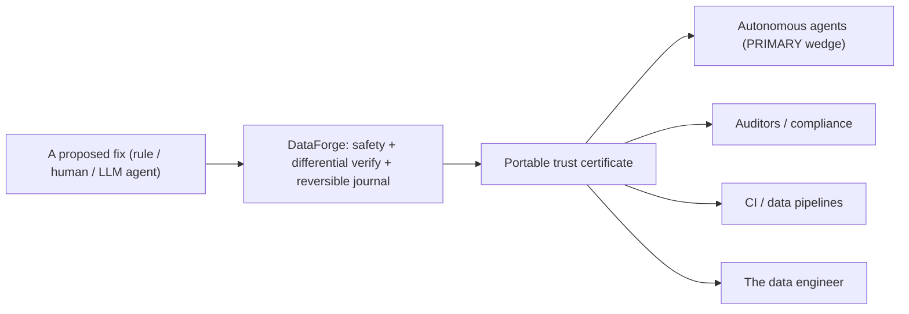

# DataForge Strategy — Center of Gravity (decision)

Status: **decided** with the maintainer (2026-07-19). This is a decision record,
not open-ended strategy prose. It is grounded in measured evidence, and it changes
what DataForge leads with.

## The decision

**DataForge is positioned as a verification / guardrail layer first, with repair
accuracy growing behind it — "both, explicitly staged."** The headline is:
*bring a proposed change from any source — deterministic rule, human, or an
autonomous agent — and DataForge proves it safe, applies it reversibly, and emits
a portable certificate anyone can independently re-verify.* Correction accuracy is
a real but secondary capability that compounds behind that guarantee over time.

## Why (evidence, not vibes)

The measured reality forces this framing. The two halves of the product are not
equally strong:

| Asset | Status | Evidence |
| --- | --- | --- |
| Differential verifier (SMT + Direct, fail-closed) | **Differentiated** | `verifier/differential.py`; N-version equivalence + corruption-oracle property tests |
| Byte-for-byte reversible, hash-chained journal | **Differentiated** | `transactions/`; `test_revert_is_bytes_identical.py`; runtime journaled-revert test |
| Portable, re-verifiable trust certificate | **Differentiated** | `certificate.verify_certificate` / `reverify_certificate`; independent in data, execution, and (schema path) implementation |
| Distribution-free auto-apply gate (conformal + drift) | **Differentiated** | `conformal.py`; enforced by `release/corrector_gate.py` |
| Deterministic correction accuracy | **Weak / narrow** | hospital F1 0.7926 (one dataset, under our scoring); flights 0.00; tax sampled 0.00 with 708 false positives |
| LLM corrector accuracy | **Not usable for auto-apply** | ~6% precision, ECE ~0.8; auto-applies nothing (correctly) |

The moat is the trust machinery; the repairer is, today, commodity and narrow.
A product judged on correction F1 competes on its weakest axis. A product judged
on "nothing incorrect is ever silently written, and you can prove it" competes on
its strongest — and that guarantee is exactly what the emerging market of
autonomous data agents lacks.

The guarantee must hold against untrustworthy *structure*, not only untrustworthy
*fix sources*. DataForge does not blindly trust the constraints it infers about
the data itself: see [trust/constraint-circularity.md](trust/constraint-circularity.md)
for the named risk, the measured evidence, and the standing corruption-oracle proof.

## Who consumes the certificate (all four; staged by leverage)

1. **Autonomous agents (primary wedge, now).** An LLM/agent proposes fixes;
   DataForge is the guardrail that proves+reverses them. This is the timely,
   highest-leverage consumer and it turns the corrector's weak accuracy from a
   liability into a *feature* (the gate correctly refuses ~94% of LLM proposals).
2. **Auditors / compliance.** The certificate is the audit artifact: proof that
   an applied change was verified and is reversible, checkable without trusting or
   re-running DataForge.
3. **CI / data pipelines.** A gate that blocks a merge/deploy unless mutations are
   proven and reversible.
4. **The data engineer.** Interactive local safety net.

## The first validating experiment (concrete, buildable now)

> **Status: SHIPPED.** The first-class `verify_and_apply(external_fix)` entry
> exists on all three surfaces (Python `dataforge.verify_and_apply`, MCP
> `dataforge_verify_and_apply`, CLI `dataforge verify-apply`). The guardrail
> value is proven in `tests/integration/test_external_agent_guardrail.py`: an
> untrusted agent's mixed batch of correct/corrupting/stale/invalid proposals
> yields **zero corruptions** — only schema-proven fixes apply, the rest are held
> with honest reasons, and the applied set re-verifies and reverts byte-for-byte.

The primitives exist (`certificate.*` public; MCP `dataforge_verify_fix`; the
verified agent loop). The missing first-class piece is **"apply-and-certify an
externally-proposed fix"** — today the gate is coupled to DataForge's own
detectors/repairers. The experiment:

- Run the verified agent (`run_agent_repair`) on a dirty dataset and report the
  **trust metrics**, not the F1: how many agent-proposed fixes were *proven and
  applied*, how many *held for review*, and — the headline — **that zero incorrect
  fixes were auto-applied**, with a certificate that re-verifies and reverts.
- Success measure: on a dataset where the raw agent/LLM is ~6% precise, DataForge
  auto-applies ~0 wrong cells (holds the rest), and every applied cell carries a
  certificate that passes `reverify_certificate`. That demonstrates the guardrail
  value independent of repair accuracy.
- **Validated and shipped:** a first-class public `verify_and_apply(external_fix)
  -> certificate` entry now gates any fix source, on the Python API, MCP, and CLI.
  The README leads with the verification-layer framing.

## Adversarial review of this decision

- *"Is this a pivot away from repair?"* No — it is a re-ordering. Repair accuracy
  still matters and still grows; it simply stops being the headline it cannot yet
  carry. "Both, explicitly staged."
- *"Does anyone want a guardrail for a weak repairer?"* The guardrail's value is
  independent of the repairer's strength — it is strongest precisely when the fix
  source is *untrusted* (an LLM agent), which is the growth market.
- *"Is the certificate valuable if nobody consumes it?"* That is the risk this
  decision addresses head-on: the experiment above makes the agent the first
  concrete consumer, and the audit/CI consumers follow. A certificate with a named
  consumer is a product; one without is a log line.

## Open questions (for the maintainer)

- **Q-A:** Should the first build be the public `verify_and_apply(external_fix)`
  entry, or a thin "guardrail for agent frameworks" integration (e.g. an MCP tool
  an external agent calls before writing)?
- **Q-B:** For the auditor consumer, is a signed/attested certificate (beyond the
  current hash-chain) in scope, or is self-verification enough for v1?
- **Q-C:** Which design-partner profile do we pursue first for the wedge — an
  agent-tooling team, or a regulated-data / MDM team? (This also unblocks the
  `design_partner_evidence` full-vision gate.)

## What this decision changes (next steps, not done here)

1. Lead product docs with the verification-layer framing (repair accuracy as the
   staged, growing capability). 2. Build/first-class the external-fix
   apply-and-certify path. 3. Run the agent trust-metrics experiment and commit the
   artifact. 4. Target the chosen wedge design partner. None of these are claimed
   as done; they are the ratified direction.

## Where correction accuracy can actually grow (2026-07-25, evidence-based)

Four independent attempts to raise correction accuracy on the RAHA residual have
now returned NO-GO, and they share one root cause worth stating plainly so it is
not re-litigated:

| Attempt | Result | Why |
| --- | --- | --- |
| Bigger LLM corrector (gpt-5.6-sol) | Certifies 0 auto-apply coverage | ~5% precise, ECE ~0.96; confidently wrong on the residual |
| Frontier agent proposer through the gate | 0 fixes pass | every FIX rejected by SMT+safety |
| Local-window FD repairer / grounded-rationale SFT | Retracted | only 7-13% robustly FD-grounded; the rest are coincidental low-cardinality FDs, in-table-indistinguishable from spurious (`f_name->gender`) |
| Threshold-tuned FD confidence | Rejected earlier (2026-07-19) | dishonest overfitting to two datasets |

**Root cause:** the residual errors are *semantic* (a wrong estimated time, a
transposed value, a spurious near-FD), and the in-table signal for them is
indistinguishable from coincidence. No amount of model scale or clever in-table
mining changes this — a larger teacher is confidently wrong in exactly the region
the gate must refuse.

**Therefore the only honest levers for MORE certified coverage are:**

1. **Authoritative external reference data (the strong lever)** — e.g. a governed
   `zip -> city` gazetteer or a canonical code list, sourced *independently of the
   dirty table*. This turns an in-table-ambiguous repair into a *provable* one, so
   it passes the existing gate and raises coverage without guessing. Note the
   nuance (measured): a merely *declared in-table FD* is weaker than it looks - of
   residual cells with a robust full-table unanimous determinant group, only ~3/18
   had a consensus equal to the clean value, because the dirty-data majority is
   often itself wrong. External reference data does not depend on the dirty
   majority, so it is the robust lever; declared FDs help only where the majority
   is already clean.
2. **Calibration research on the proposer's confidence** — the binding constraint
   is ECE on the hard residual, not capability. A proposer whose confidence is
   trustworthy enough for conformal to certify a non-empty accepted set would move
   the coverage number; a bigger model that is *confidently* wrong does not.

**What this closes and what it opens:** "use a stronger LLM to raise *auto-apply*
accuracy" is answered - its verified-gate ROI is ~0 (corrector, agent, teacher,
grounded-rationale all NO-GO). But a first-principles re-derivation found a role
the correction frame hid: **gpt-5.6-sol as a review-queue TRIAGER.** Measured on
hospital (natural distribution, uniform n=500): it lifts review-queue precision
5.0% -> 40.7% (95% CI [29, 53]) while retaining ~96% of real errors - an ~8x
cleaner human-review queue, never touching the auto-apply gate. It does NOT find
errors the deterministic ensemble misses (flights recall-booster NO-GO: 4.7%
residual recall). So the frontier model's durable roles are two, both
"LLM proposes, human/verifier disposes": the legible guardrail demo (Phase C
playground proposer) and review-queue triage. The triage capability is now built
and measured as a bench method (`llm_review_ranker`): across datasets it beats the
free detector-confidence baseline decisively WHERE the queue floods (hospital
ROC-AUC 0.95 vs 0.49; rayyan 0.95 vs 0.54) and adds nothing where the queue is
already high-precision (flights 0.51, 72% base) - so the honest product rule is to
fire the LLM triager only on low-base-precision queues (a free per-run signal).
Reproducible evidence: `scripts/data/measure_teacher_grounding.py`,
`scripts/bench/probe_llm_detector.py`, `dataforge/bench/ranking_metrics.py`,
`eval/results/llm_detector_confirm.json`, `eval/results/llm_review_ranker_*.json`,
DECISIONS 2026-07-25.
