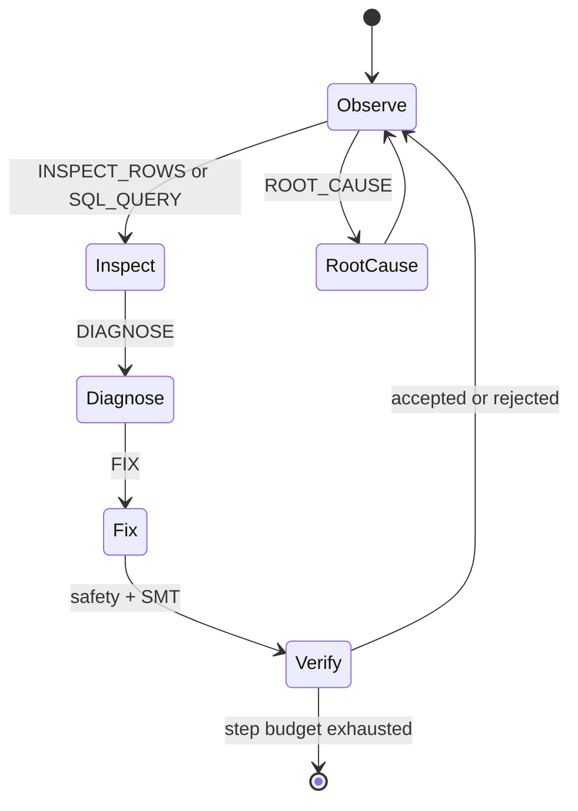
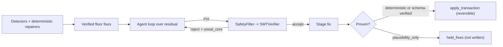

# Agent Loop

DataForge separates environment actions from repair execution. The agent loop
can inspect rows, query the in-memory dataset, run statistics, record
hypotheses, diagnose issues, propose fixes, and ask for root-cause analysis.

The loop is intentionally local and auditable. It does not require an LLM, and
the OpenEnv surface can be exercised entirely with deterministic actions.

## Design rules

- Tool actions are typed before dispatch.
- SQL actions are read-only and capped.
- Fix actions must pass the same safety and verification checks used by the CLI.
- Terminal reward is based on detection, fix quality, false positives, and step
  discipline.

## Verified agent (product mode)

The same loop powers an opt-in autonomous product mode: `dataforge repair
--agent` and the MCP tool `dataforge_agent_repair`. It is *verified-agent*, not
LLM-YOLO:

1. **Deterministic-first seed.** Detectors and deterministic repairers run first
   (the high-accuracy floor). Those fixes are already safety + SMT verified.
2. **Closed loop over the residual.** An autonomous policy (hosted provider by
   default; local trained model, deterministic, or a registered `custom:<name>`
   policy selectable) proposes actions for the issues the rules could not fix.
   Every `FIX` is routed through the same `SafetyFilter` and `SMTVerifier`; a
   rejection returns its reason and SMT unsat-core so the policy self-corrects on
   the next turn.
3. **Proven-only gate.** An agent value is LLM-derived, so it is *proven* only when
   an authoritative schema verified it. Otherwise it was checked solely by the
   advisory inferred guard (whose gaps are enumerated in `docs/trust/inferred-guard-gaps.md`),
   so it is `plausibility_only` and is **held** in `held_fixes` rather than written.
4. **Single verified commit.** Floor and proven agent fixes commit through the existing
   `apply_transaction` — atomic, journaled, byte-for-byte reversible.

Because the agent only *adds* proven fixes on top of the floor, its output can never be
worse than the deterministic baseline.

**What is guaranteed, precisely.** No unproven value reaches disk unless you pass
`--allow-unproven-autoapply`, and that choice is recorded truthfully as not-proven in
the certificate. This holds for any policy, however weak or adversarial, because the
gate is enforced *inside* `apply_transaction` rather than by the agent controller
remembering to call it. Live-LLM writes are additionally soft escalation-gated
(`NO_UNCONFIRMED_LLM_WRITE`), so they also require an explicit `--confirm-escalations`
acknowledgement.

!!! warning "Correction (2026-08-09)"

    This page previously said "nothing unverified ever reaches disk — regardless of the
    policy." That was **false**. The agent controller called `apply_transaction`
    directly and skipped the proven-only partition, so a schema-less `llm_live` value
    was written after clearing only a structural check (row in bounds, column exists).
    The invariant `DECISIONS.md` declared on 2026-07-11 was enforced on the pipeline
    surface only. It is now enforced inside the mutation primitives, and
    `tests/property/test_no_corruption_invariant.py` parametrizes it over every write
    surface instead of over one surface's policy.

Promotion of the agent to the *default* repair path is gated by
`dataforge.bench.agent_promotion_verdict`: the agent must beat the deterministic
baseline F1 with zero safety regressions and floor parity.

## Selectable backends

The policy backend is a first-class choice (`dataforge repair --agent --policy`,
or the `policy` argument of the MCP `dataforge_agent_repair` tool):

- `hosted` (default) — an LLM over the provider client. Pick the provider with
  `--provider groq|gemini` (falls back to `DATAFORGE_LLM_PROVIDER` / key
  autodetect). Needs an API key; **fails fast** with an actionable message if
  none is configured.
- `local` — the fine-tuned local model (free, private, offline). Fails fast if
  transformers/the model are unavailable.
- `deterministic` — floor only; exact parity with the legacy pipeline.
- `custom:<name>` — a policy registered via
  `dataforge.agent.register_policy(name, factory)`. Custom policies are still
  wrapped by the verified executor and subject to the proven-only gate, so they
  cannot write an unproven value.
