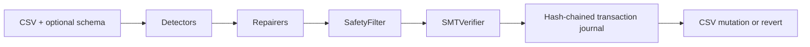

# DataForge

DataForge is the official release name for the DataForge codebase. It is a
CLI-first toolkit for finding and repairing data-quality issues in tabular
files. It profiles CSVs, proposes deterministic repairs, checks
changes through safety and verification gates, and records applied fixes in a
reversible transaction log.

The PyPI/TestPyPI distribution family is `dataforge_07*` because the
unqualified `dataforge` project name is occupied by unrelated packages.
`pip install dataforge_07` installs the `dataforge` import namespace and
`dataforge` CLI.

The current checkout is an alpha meant for local CSV profiling, repair
experiments, benchmarks, and training/evaluation research. It is not a
warehouse-native service, it does not make production model-quality claims, and
it does not claim design-partner or customer validation evidence yet.

## What ships locally

- `dataforge profile`, `dataforge repair`, `dataforge revert`,
  `dataforge watch`, `dataforge audit`, `dataforge bench`, and
  `dataforge constraints review`.
- Eleven issue families. Two of them, `fd_violation` and `missing_value`, may
  auto-apply a repair and only from a declared functional dependency; the rest are
  detection-only or calibration-bound. See [detectors](detectors.md).
- Reviewable `constraint_review_v1` artifacts with explicit accept/reject
  decisions before inferred constraints affect repair.
- Deterministic repairers wired through `SafetyFilter` and `SMTVerifier`.
- Distribution-free calibrated auto-apply: conformal per-class thresholds, post-hoc
  probability calibration (`calibration_map`), and a PSI drift guard, combined in the
  engine gate so LLM corrections auto-apply only when proven, in-distribution, and
  certified (else propose-not-apply). Today no class is certified (the shipped
  gpt-5-mini corrector is too imprecise), so all LLM corrections stay propose-not-apply.
- Append-only hash-chained transaction journals with immutable source snapshots.
- OpenEnv-compatible actions for data inspection, SQL, statistics, diagnosis,
  repair, and root-cause analysis.
- Benchmark scripts and generated reports for Hospital and Flights.
- A React playground deployed through Cloudflare Workers Static Assets, backed
  by a Hugging Face Docker Space API.
- Published PyPI/TestPyPI packages for the core CLI, MCP server, eval harness,
  dbt adapter, and reusable agent patterns.

The current verified public playground is
`https://dataforge.praneshrajan15.workers.dev/playground`; the API backend is
`https://Praneshrajan15-dataforge-playground.hf.space`. That Workers URL is
the production playground surface and release URL.

## Benchmark Evidence

<!-- BENCH:START -->
Generated from `eval/results/agent_comparison.json` (schema `dataforge_benchmark_run_v2`, seeds `0, 1, 2`, git `236df758dbdd`, dirty `true`).

| Method | Precision | Recall | F1 | Avg Steps | Quota Units | GPU Hours |
| --- | --- | --- | --- | --- | --- | --- |
| heuristic | 0.3585 | 0.4430 | 0.3963 | 361.50 | 0.0000 | 0.0000 |
| random | 0.0057 | 0.0004 | 0.0008 | 125.50 | 0.0000 | 0.0000 |

See `BENCHMARK_REPORT.md` for per-dataset tables, error bars, and citation-only SOTA rows.

Dataset bytes are pinned to BigDaMa/raha revision `7be1334b8c7bbdac3f47ef514fb3e1e8c5fc181c` for hospital, flights; dirty/clean SHA-256s are recorded in the JSON metadata.
<!-- BENCH:END -->

## Core flow

## Start here

Run the [quickstart](quickstart.md) first. Use the [playground
guide](playground.md) for the hosted Analyze -> Risk -> Constraint Review ->
Verified Repairs -> Receipt surface, then read the
[architecture reference](architecture.md) if you need the full mental model
before extending the system.
